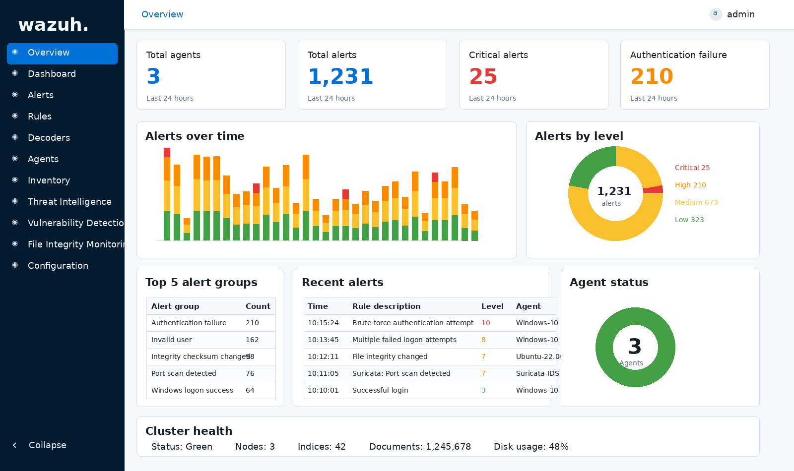
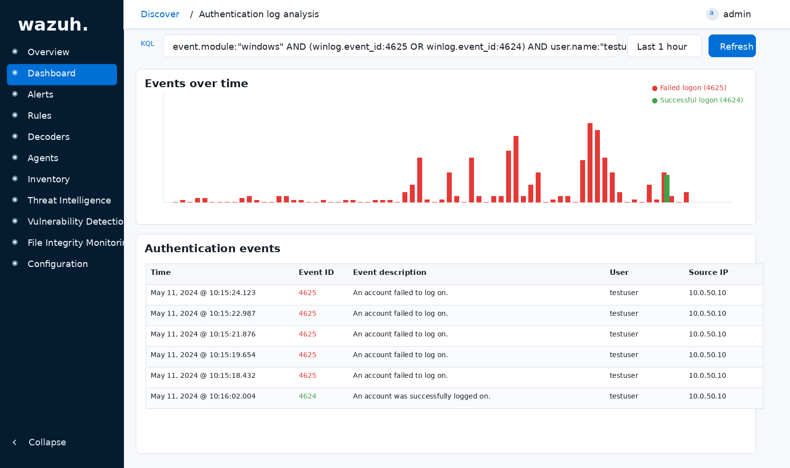
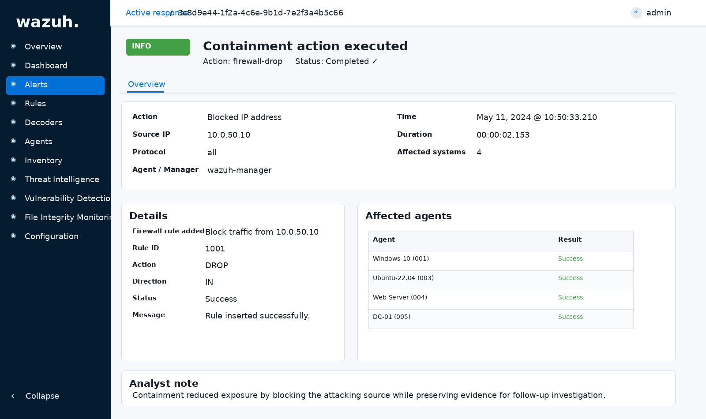

# 🛡️ Home Threat Detection & Incident Response Lab

## Overview

This project simulates a small **Security Operations Center (SOC)** environment using **Wazuh, Suricata, Elastic Stack, and Windows/Linux telemetry** to investigate attacker behavior across endpoint and network activity.

The lab demonstrates how detection logic, alert triage, MITRE ATT&CK mapping, and containment actions work together in a realistic incident response workflow.

Custom detection rules were developed across **Wazuh and Suricata**, mapped to **MITRE ATT&CK techniques**, and tuned for a simulated enterprise-style monitoring environment.

---

# 🎯 Project Objectives

This lab was designed to:

* Simulate real SOC detection workflows
* Develop custom Wazuh detection rules
* Build Suricata IDS detection logic
* Investigate endpoint telemetry alerts
* Map alerts to MITRE ATT&CK techniques
* Document incident timelines
* Demonstrate containment actions using active response

---

# 🧱 Lab Architecture

### Detection Stack

| Component        | Role                               |
| ---------------- | ---------------------------------- |
| Wazuh            | SIEM + host detection              |
| Suricata         | Network IDS                        |
| Elastic / Kibana | Log analysis + visualization       |
| Windows Endpoint | Authentication + process telemetry |
| Linux Endpoint   | File integrity monitoring          |
| Kali Linux       | Attacker simulation                |

See:

```
architecture/lab-architecture.md
```

---

# 🔎 Detection Scenarios Simulated

This lab includes investigation walkthroughs for:

* Brute-force authentication attempts
* PowerShell encoded command execution
* LSASS credential access attempts
* DNS tunneling behavior
* Reverse shell activity
* File integrity monitoring alerts
* Network reconnaissance / port scanning

Detection logic is documented in:

```
detections/
```

---

# 🧠 Custom Detection Engineering

Custom rules were written to simulate production-style SOC detections.

### Wazuh Rules

* PowerShell encoded command detection
* LSASS credential dumping detection
* Brute-force authentication detection
* Auto-block attacker IP active response

Location:

```
custom-wazuh-rules/
```

---

### Suricata Rules

* DNS tunneling long subdomain detection
* Reverse shell activity detection

Location:

```
custom-suricata-rules/
```

---

# 🧬 MITRE ATT&CK Mapping

Example mapped techniques:

| Technique | Description                           |
| --------- | ------------------------------------- |
| T1110     | Brute force authentication            |
| T1059.001 | PowerShell execution                  |
| T1003.001 | LSASS credential dumping              |
| T1071.004 | DNS tunneling                         |
| T1105     | Reverse shell / ingress tool transfer |

See:

```
mitre-mapping/mitre-techniques.md
```

---

# 📸 Investigation Screenshots

SOC-style investigation workflow examples:

```
screenshots/
```

Includes:

* Wazuh alert triage
* Authentication log analysis
* Suricata IDS alerts
* Suspicious command execution
* Incident timeline reconstruction
* Containment action demonstration

---

# 🚨 Incident Response Workflow Demonstrated

Example workflow simulated:

```
Telemetry Collection
→ Alert Trigger
→ Log Investigation
→ Timeline Reconstruction
→ MITRE Mapping
→ Containment Action
```

Walkthrough:

```
investigation-timeline/incident-walkthrough.md
```

---

# 🧯 Active Response Example

Wazuh active response automatically blocks attacker IP after repeated authentication failures:

```
firewall-drop
timeout: 600 seconds
```

Location:

```
custom-wazuh-rules/auto-block-bruteforce.xml
```

---

# 🧰 Skills Demonstrated

* Detection engineering using custom Wazuh rules
* Network intrusion detection using Suricata IDS
* Security log ingestion and analysis using Elastic Stack
* Endpoint telemetry investigation workflows
* MITRE ATT&CK technique mapping
* SOC investigation timeline reconstruction
* Incident response playbook development
* Automated containment using Wazuh Active Response

---

# 📈 Detection Engineering Focus

This environment mirrors real SOC detection pipelines by combining:

* Endpoint telemetry
* Network IDS signals
* Behavioral rule logic
* MITRE-aligned detection coverage
* Automated response actions

The goal of this project is to demonstrate practical detection engineering skills using open-source tooling in a simulated enterprise monitoring workflow.

---

# 🔐 Future Improvements

Planned enhancements:

* Additional lateral movement detections
* Privilege escalation detection logic
* Persistence technique monitoring
* Expanded Suricata threat coverage
* Defender Advanced Hunting correlation examples

---

## Investigation Walkthrough Screenshots

### Wazuh Security Monitoring Dashboard


### Brute Force Authentication Alert


### Authentication Log Analysis


### Suricata Port Scan Detection


### File Integrity Monitoring Alert


### Suspicious Command Execution Detection


### Incident Timeline Reconstruction


### Containment Action (Active Response Block)

