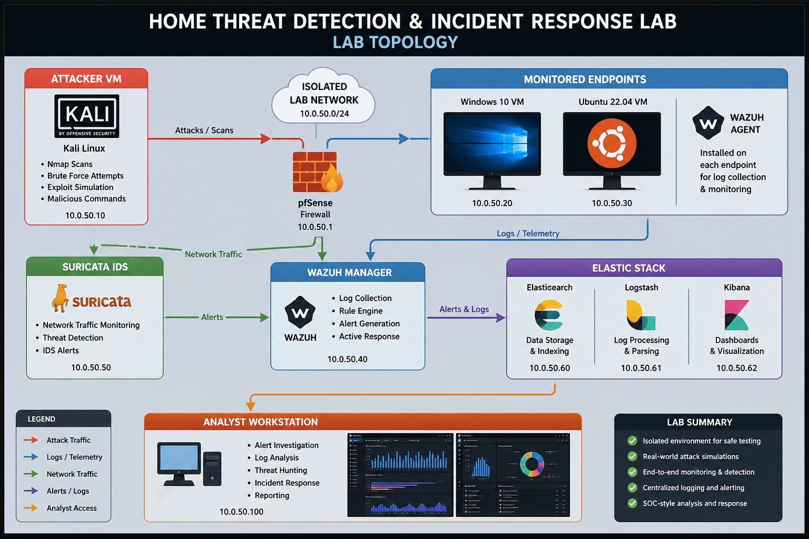

# Lab Architecture

This document describes the architecture and telemetry flow for the **Home Threat Detection & Incident Response Lab** environment.

The lab simulates a small enterprise-style SOC monitoring pipeline using endpoint telemetry, network intrusion detection, centralized logging, and automated response controls.

---

# Lab Topology Diagram

---

# Network Overview

The environment operates inside an isolated subnet:

10.0.50.0/24

This network contains:

Attacker infrastructure  
Monitored endpoints  
Firewall segmentation  
Network IDS visibility  
Endpoint detection platform  
Centralized logging pipeline  
SOC analyst workstation  

This structure allows safe simulation of attacker behavior while maintaining full detection visibility.

---

# Attacker System

Host:

Kali Linux  
IP Address:

10.0.50.10

Purpose:

Simulates adversary behavior inside the lab environment.

Activities performed:

Nmap scanning  
Brute-force authentication attempts  
Encoded PowerShell execution  
Credential access attempts (LSASS interaction)  
Reverse shell simulation  
DNS tunneling simulation  

These behaviors generate telemetry across both endpoint and network detection layers.

---

# Network Segmentation Firewall

Device:

pfSense Firewall  
IP Address:

10.0.50.1

Purpose:

Provides segmentation between attacker infrastructure and monitored endpoints.

Responsibilities:

Traffic routing  
Network isolation  
Controlled attack simulation boundary  
Security monitoring visibility support

---

# Monitored Endpoints

Systems:

Windows 10 VM — 10.0.50.20  
Ubuntu 22.04 VM — 10.0.50.30  

Installed Component:

Wazuh Agent

Telemetry collected:

Authentication logs  
Process execution activity  
Command-line arguments  
Credential access attempts  
System behavior indicators

These endpoints simulate monitored enterprise workstations.

---

# Network Intrusion Detection Layer

System:

Suricata IDS  
IP Address:

10.0.50.50

Purpose:

Monitors network traffic between attacker infrastructure and monitored endpoints.

Detection coverage:

Port scanning behavior  
Reverse shell connections  
DNS tunneling indicators  
Suspicious outbound traffic

Suricata provides network-layer detection visibility complementary to endpoint telemetry.

---

# Endpoint Detection Platform

System:

Wazuh Manager  
IP Address:

10.0.50.40

Purpose:

Collects endpoint telemetry and applies custom detection rules.

Detection coverage:

Encoded PowerShell execution  
Authentication attack patterns  
Credential dumping attempts  
Suspicious process execution behavior

Wazuh Active Response enables automated containment actions such as attacker IP blocking.

---

# Centralized Logging Pipeline

Elastic Stack Components:

Elasticsearch — 10.0.50.60  
Logstash — 10.0.50.61  
Kibana — 10.0.50.62

Purpose:

Centralizes alerts and telemetry from Wazuh and Suricata.

Elastic Stack supports:

Log ingestion  
Alert correlation  
Threat hunting workflows  
Timeline reconstruction  
Security dashboard visualization

Kibana serves as the primary SOC analyst investigation interface.

---

# Analyst Workstation

Host:

SOC Analyst System  
IP Address:

10.0.50.100

Purpose:

Used to investigate alerts generated across the monitoring environment.

Typical workflows include:

Alert triage  
Log correlation  
Threat hunting  
Detection validation  
Incident response analysis

This workstation simulates a real-world SOC investigation environment.

---

# Detection Visibility Flow

Telemetry flows through the monitoring pipeline as follows:

Endpoints send telemetry to Wazuh Manager

Network traffic is inspected by Suricata IDS

Alerts and logs are forwarded into Elastic Stack

Kibana dashboards support analyst investigations

Wazuh Active Response performs automated containment when thresholds are triggered

This layered monitoring architecture mirrors enterprise SOC detection pipelines.
