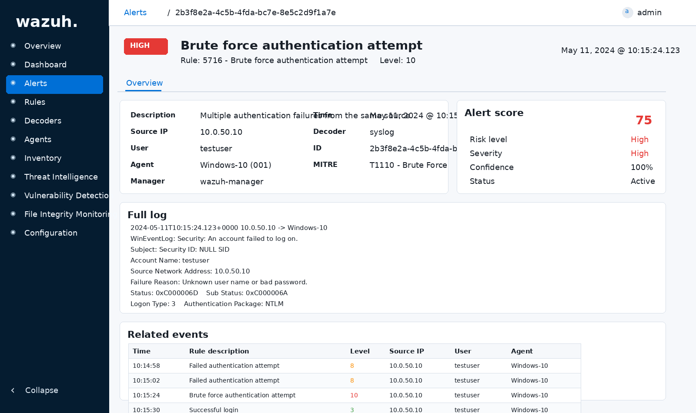
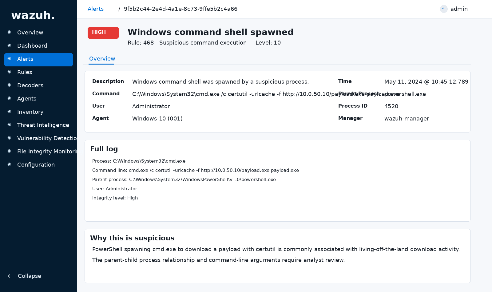
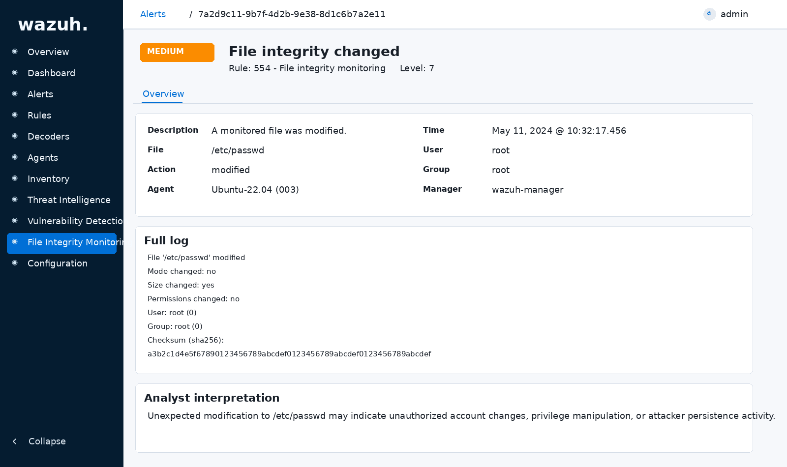
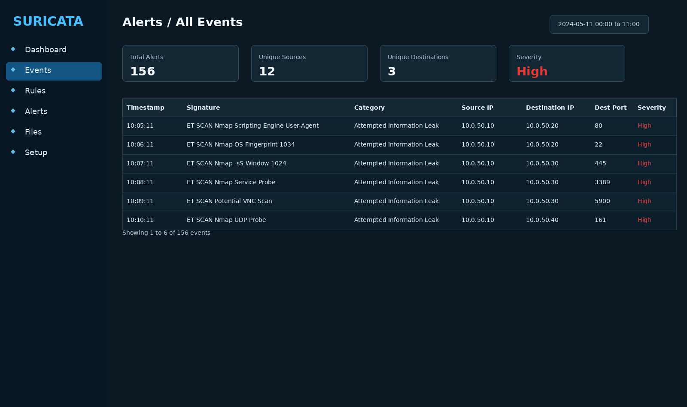
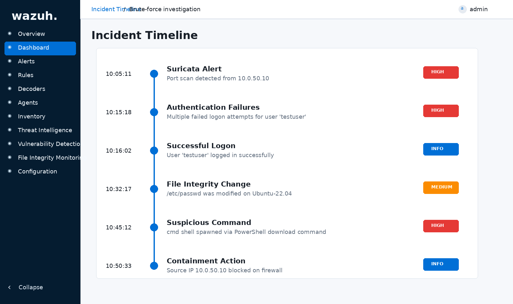

## Detection Pipeline Examples

### Brute Force Authentication Detection

This alert demonstrates detection of repeated authentication failures originating from an attacker-controlled system.  
Wazuh correlated multiple failed login attempts and triggered a high-severity brute force alert mapped to MITRE ATT&CK technique **T1110 – Brute Force**.

The alert includes:

• Source attacker IP address  
• Target username  
• Authentication method (NTLM)  
• Event correlation timeline  
• Alert severity scoring  
• Automatic containment via Active Response firewall blocking

Authentication failures detected and automatically blocked using Wazuh Active Response.

Detection logic validated using simulated password spraying activity from the Kali attacker VM inside an isolated lab network.

-----

### Encoded PowerShell Execution Detection

This alert demonstrates detection of suspicious encoded PowerShell execution activity commonly used by attackers to obfuscate command payloads and evade traditional security controls.  
The detection identifies usage of the **-EncodedCommand** argument and maps to MITRE ATT&CK technique **T1059.001 – PowerShell**.

The alert includes:

• Encoded command-line argument detection  
• Parent-child process relationship visibility  
• Suspicious execution context identification  
• Command-line telemetry inspection  
• Alert severity classification  
• Detection correlation using Wazuh rule engine

Detection logic validated using simulated encoded PowerShell execution from the Kali attacker VM within the isolated lab network environment.

This detection workflow mirrors enterprise SOC monitoring pipelines where command-line telemetry is inspected to identify obfuscated attacker execution techniques.

-----

### LSASS Credential Access Detection

This alert demonstrates detection of unauthorized access attempts targeting the LSASS process, a common technique used by attackers to extract credentials from memory.  
The detection maps to MITRE ATT&CK technique **T1003 – Credential Dumping**.

The alert includes:

• Suspicious process interaction with LSASS  
• Non-system process credential access behavior  
• Privileged memory access attempt detection  
• Process execution telemetry correlation  
• Alert severity escalation logic  
• Endpoint credential theft visibility

Detection logic validated using simulated credential access activity within the Windows endpoint to emulate attacker credential dumping behavior.

This detection workflow reflects enterprise EDR monitoring strategies used to identify credential harvesting attempts prior to lateral movement escalation.

-----

### Reverse Shell Activity Detection

This alert demonstrates detection of reverse shell command-and-control communication initiated from a monitored endpoint toward an attacker-controlled system.  
The detection maps to MITRE ATT&CK technique **T1071 – Application Layer Protocol**.

The alert includes:

• Suspicious outbound command-and-control traffic  
• Reverse shell connection behavior detection  
• Network telemetry inspection via Suricata IDS  
• Alert correlation across monitored network traffic  
• Indicators of remote interactive session establishment  
• Network-based threat detection visibility

Detection logic validated using simulated reverse shell activity initiated from the attacker VM toward monitored endpoints inside the isolated lab network.

This detection workflow mirrors enterprise network intrusion detection pipelines used to identify attacker persistence and remote command execution channels.

-----

### DNS Tunneling Activity Detection

This alert demonstrates detection of suspicious DNS traffic patterns consistent with DNS tunneling activity used for covert command-and-control communication or data exfiltration.  
The detection maps to MITRE ATT&CK technique **T1071.004 – DNS**.

The alert includes:

• Abnormal DNS query pattern detection  
• Suspicious domain request behavior visibility  
• Covert communication channel identification  
• Network telemetry inspection using Suricata IDS  
• Alert severity classification based on tunneling indicators  
• Indicators of potential data exfiltration activity

Detection logic validated using simulated DNS tunneling activity generated from the attacker VM within the isolated lab environment.

This detection workflow reflects enterprise SOC monitoring strategies used to identify covert attacker communication channels attempting to bypass perimeter defenses.

-----

### Elastic Stack Investigation Timeline Visualization

This dashboard demonstrates centralized log correlation and investigation workflow visibility across endpoint and network telemetry sources aggregated within the Elastic Stack SIEM platform.

The dashboard includes:

• Authentication event correlation timeline  
• Process execution telemetry visualization  
• Network alert aggregation visibility  
• Threat investigation workflow reconstruction  
• Multi-source telemetry correlation across monitored endpoints  
• Analyst-driven threat hunting investigation support

Visualization validated using correlated alerts generated during simulated attack activity across monitored endpoints within the isolated detection lab environment.

This dashboard mirrors enterprise SOC investigation workflows where analysts reconstruct attack timelines using centralized SIEM telemetry correlation.

